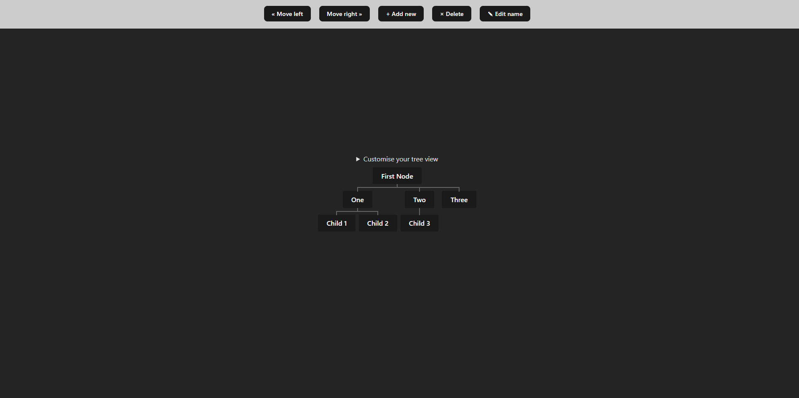

# React Node tree

A litle project to learn how to make a DOM structure with React based on This article https://medium.com/@ross.angus/sitemaps-and-dom-structure-from-nested-unordered-lists-eab2b02950cf

https://react-node-tree.vercel.app/

# Features

- [x] Add a child to it's parent
- [x] Remove a node
- [] Edit a node
- [] Customise tree view (Line color, line width, gutters)
- [] Mode child nodes to left or right

    

